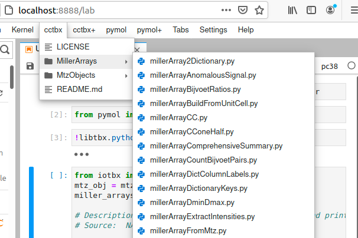

# jupyterlabcctbxsnips: Templates for writing and running cctbx in Jupyter Notebooks.

[](https://opensource.org/licenses/MIT)

[](https://doi.org/10.5281/zenodo.4429336)

The **cctbx** <a href="https://github.com/cctbx/cctbx.github.io"> Computational Crystallography Toolbox </a> is a core package for computational crystallography that has been developed over the past two decades that the Lawrence-Berkley National Laboratory.
It contains the open source components of the <a href="https://phenix-online.org"> Phenix project</a>.
It has C++ routines wrapped in Python to ease using it to develop new software tools for analyzing atomic coordinates and diffraction data.
Because it is can be run with Python, it can also be run from Jupyter Notebooks, the defacto computing platform for data science.
To ease the running of **cctbx** in Jupyter Notebooks, we developed the **jupyterlabcctbxsnips** of code templates.
Access to the code templates or snippets requires the editing of the Jupyter Notebook from inside of JupyterLab, a browser based IDE for Jupyter Notebooks.


This readme file serves this GitHub site.
There are three related sites:  <a href="https://github.com/MooersLab/jupyterlabcctbxsnipsplus">jupyterlabpymolpysnips</a>, and <a href="https://github.com/MooersLab/jupyterlabpymolpysnipsplus">jupyterlabpymolpysnipsplus</a>. 
As you might have deduced, **PyMOL** and **cctbx** can be run together in the same Jupyter Notebook. 
This is best done when they share the same Python interpeter.
See the associated GitHub Page for more information about running these two programs together and for list the snippet names and descriptions by <a class="tab" href="https://mooerslab.github.io/jupyterlabcctbxsnips/"> category.</a>
The README.md contains the installation instructions for only the **jupyterlabcctbxsnips** and **jupyterlabcctbxsnipsplus** snippet libraries.

<a id="table-of-contents"><h2>Table of Contents</h2></a>

* [Motivation](#motivation)
* [Tech Stack](#technology-stack)
* [Installation](#installation)
* [Configuration Setup](#configuration-setup)
* [Usage](#usage)
* [Testing](#testing)
* [Requests for new snippets and text editors](#requests)
* [Bug reports](#bugreports)
* [Roadmaps](#roadmap)
* [License](#license)
* [Contact Information](#contact-information)
* [How to cite](#citation)


<a id="motivation"><h2>Motivations for this project</h2></a>


The figure below shows part of the cascading menus for the **cctbx** library after it has been installed successfully.
The submenus correspond to the names of subfolders in the **cctbx** folder in the multimenus_snippets folder, which you create inside of the Jupyter folder in your local library folder (i.e., `~/Library` on the Mac).
Each ultimate menu item is a Python snippet file. 
The selection of a snippet file by clicking on it with the left-mouse button inserts its content into a new cell below the current cell. 
The **millerArrayFromMtz.py** snippet at the bottom of the pulldown menu was selected and inserted in the figure below. 
Commented lines have text that describes what this snippet does. 
The code in this cell would be executed by entering Shift-Enter.

<p align="center"></p>


The mtzObjectSummary.py snippet prints a summary of an mtz file.
The data in this mtz has columns of I(+) and I(-).
We use these data to make a I(+) vs I(-) scatter plot below.
The mtz file contains data for SirA-like protein (DSY4693) from Desultobacterium hafniense, Northeast Structural Genomics Consortium Target DhR2A.


<p align="center"></p>

The I(+) vs I(-) plot below was made after reading the X-ray data into a **cctbx** Miller array, a data structure designed for X-ray data.
The I(+) and I(-) were eventually read into separate lists.
We plot the two lists against each other in a scatter plot.
This plot was adapted from an example in the <a href="https://github.com/Hekstra-Lab/reciprocalspaceship">ReciprocalSpaceship project</a> from the Hekstra Lab.
This new project takes a more Pythonic approach. 
For example, it uses the Pandas package to manage diffraction data whereas **cctbx** uses a special C++ data structure for diffraction data.
A recent preprint about the ReciprocalSpaceship project can be found <a href="https://www.biorxiv.org/content/10.1101/2021.02.03.429617v1.full.pdf">here</a>.


<p align="center"></p>

There are two advanced Matplotlib features in this plot.
First, the imported `MultipleLocator` function enforced even distribution of the tick labels.
Second, the imported `FunctionFormatter` added the commas to the thousandths place in the tick mark labels.


[Return to Table of Contents](#table-of-contents)


<a id="technology-stack"><h2>Technology Stack</h2></a>

| Technology | Version| Description                 |
|------------|--------------|-----------------------------|
| [CCTBX](https://github.com/cctbx/cctbx_project) |   2.4.0    | Molecular graphics program         | 
| Python | 3.7-3.9      |  Programming language          |
| [JupyterLab](https://pypi.org/project/jupyterlab/)                                          | >=2.0    | A IDE for editing Jupyter Notebooks.                                                             |
| [jupyterlab-snippets](https://github.com/QuantStack/jupyterlab-snippets)                    | 0.4.0    | Required extension                                                                                |
| or this alternate pair of programs                                                          |          |                                                       
| [JupyterLab](https://pypi.org/project/jupyterlab/)  | 2.2.0   | An IDE for editing Jupyter Notebooks. Version 3.0 does not work with jupyterlab-snippets-multimenus|
| [jupyterlab-snippets-multimenus](https://pypi.org/project/jupyterlab-snippets-multimenus/) | 0.1.2 | Required extension |
| [Node.js](https://nodejs.org/en/)     |  >=10.0.0      | Required by Jupyter and many JupyterLab extensions.   |
| git        | 2.25.1  | Eases the downloading and updating of the libraries. |


Python and git are probably already installed.
If not, they are best installed with a software package manager like Anaconda, homebrew (Linux, Mac), macports (Mac), fink (Mac), apt-get on Ubuntu, yum on Centos, cygwin in Windows, and so on.

**cctbx** is most easily installed into its own environment by using Anaconda with the command `conda create -n my_env -c conda-forge cctbx-base python=3.8`.
This command will also install Python 3.8. 
**cctbx** also works with Python3.7.
I have also installed cctbx successfully with Python 3.9 
Note that the Anaconda Navigator does not support creation of new envs with Python3.9 as of July 17, 2021, so you have to do so by the command line.

Sometimes the planets are in alignment and you can install cctbx-base and pymol-bundle in the same environment.
This worked for me in January 2021, but by July 2021, there were too many dependency conflicts.
In the latter case, install PyMOL in a separate conda env, make a Juptyer kernel for that env, and just switch kernels to use cells with PyMOL and other cells with cctbx in the same Jupyter notebook.

To install **cctbx** with **PyMOL**, see the protocols on the associated<a class="tab" href="https://mooerslab.github.io/jupyterlabcctbxsnips/">GitHub Page.</a>

JupyterLab needs to be version 2.2.0 for **jupyterlab-snippets-multimenus** to run. 
The current version of **JupyterLab** is 3.0. 
Note that JupyterLab no longer needs an external installation of Node,=.js.

**Node.js** can be downloaded from the developer's site, or it can be installed with a package manager.
It needs to be more recent than version 10.0.0.
On some operating systems, **npm** is not installed automatically with **Node.js** and has to be installed too.

Some of the snippets are limited to Python3 code.
If you are using a version of **cctbx** that relies on Python2, you can rewrite the snippet's code to be Python2 compliant.
This often merely involves replacing  the print() functions in Python3 with print statements in Python2.
The python script [**3to2**](https://pypi.org/project/3to2/) automates this process.
Multiple versions of **cctbx** can operate on a computer if they are in separate environments, so you do not have to delete the Python2 version of **cctbx**.


[Return to Table of Contents](#table-of-contents)


<a id="installation"><h2>Installation of the snippet library</h2></a>

Assuming that **git**, **JupyterLab**, **jupyterlab-snippets-multimenus**, and **cctbx** are already installed, run the following commands one line at a time.
On the Mac, **git** is installed with the Command Line Tools.
If you enter `git --version` in the terminal and do not get an error message, you have git installed.
If you enter `ls /Library/Developer/CommandLineTools` and see `SDKs` as a subfolder, you have the commandline tools installed.

```bash
jupyter --path
```

Move to the first directory under Data.
This will be `~/.local/share/jupyter` on Linx and  `~/Library/Jupyter` on the Mac.


```bash
cd ~/.local/share/jupyter 
```

Make the directory where the libraries will be stored and move to this directory.

```bash
mkdir multimenus_snippets
cd multimenus_snippets
```

Use git to clone the repos into the new folders respectively.


```bash
git clone https://github.com/MooersLab/jupyterlabcctbxsnips.git cctbx
git clone https://github.com/MooersLab/jupyterlabcctbxsnipsplus.git cctbx+
````

The snippets in the **cctbxsnips+** library have a second copy of the code in a comment with the tab stops marked as follows `${1:default value}`.
Tab stops are sites of parameter values that may need to be edited to customize the snippet.
In most text editors, you hit tab to advance to the next tab stop.
**JupyterLab** does not yet support tab stops.
Use the **cctbx+** library when you need guidance in editing a snippet.
The content of the active part of the snippet is the same in both libraries.
The commented code in the **cctbx+** snip library may annoy experienced users who do not need help with editing and who do not want the extra comments in their code.


Alternatively, you can download the repository as a zip file by clicking on the green **code** button above.
However, **git** eases the updating of the libraries are a later time.
You would navigate to the `multimenus_snippets/cctbx` folder and then enter `git pull` to update the library.
This is far less painful than down downloading the library via as a zip file.
Repeat for `cctbx+`, if needed.
Important!
Navigate back to your home directory before running **JupyterLab** (e.g. `cd` or `cd ~/`).

Now, fire up **JupyterLab** and use the snippets to build new **cctbx** scripts. 

```bash
jupyter lab

````


[Return to Table of Contents](#table-of-contents)


JupyterLab can also use the **jupyterlab-snippets** extension to make the snippets available via a **snippets** pull-down menu.
This package can be installed by conda, pip, or by the extension manager in Jupyter Lab.

Assuming that **JupyterLab**, **jupyterlab-snippets**, and PyMOL are already installed, run the following commands one line at a time:

```bash
jupyter --path
cd ~/.local/share/jupyter # change as per output from prior line. Use cd ~/Library/Jupyter on the Mac.
mkdir snippets
cd snippets
git clone https://github.com/MooersLab/jupyterlabcctbxsnips.git pymol
git clone https://github.com/MooersLab/jupyterlabcctbxsnipsplus.git pymol+
```

When you open **JupyterLab**, you will find a **snippet** pull-down menu on the JupyterLab menu-bar.
There will be a **cctbx** sub-menu and a **cctbx+** sub-menu under this pull-down.

JupyterLab needs to be version >=2.2.0 for **jupyterlab-snippets** to run. 
The current version of **JupyterLab** is >3.0.

**Node.js** can be downloaded from the developer's site, or it can be installed with a package manager.
It needs to be more recent than version 10.0.0 


<a id="configuration-setup"><h2>Configuration Setup</h2></a>

The snippet library is independent of **cctbx**. 
No modification of **cctbx** is required. 

[Return to Table of Contents](#table-of-contents)


<a id="usage"><h2>Usage</h2></a>

The animation at the top of the page conveys the essential knowledge for usage. 

[Return to Table of Contents](#table-of-contents)


<a id="testing"><h2>Testing</h2></a>

### Quick check of the installation


To verify that **cctbx** can be called from a Jupyter Notebook.
Launch JupyterLab and open a new notebook.
Select the appropriate kernel.
Enter in the first cell `from iotbx.map_model_manager import map_model_manager` and enter `Shift-Return`.
No error message should appear.

You can also check from the terminal after activating the appropriate environment:

```bash
python -c 'from iotbx.map_model_manager import map_model_manager'
```

If all goes well, the terminal will hang for about five seconds and then return nothing.
Otherwise, error messages will be printed in the terminal window.


### More extensive tests


The **cctbx**installation in a conda environment can be tested by running the following bash script if installed with Python3.7.
Copy the code below to a plain text file called test.sh with a text editor.
Make the script executable: `chmod +x test.sh`.
Run the script as `./test.sh`.
The tests will take about 30-60 minutes to run and most should pass.

```bash
#! /bin/sh
set noglob
set verbose
libtbx.python $CONDA_PREFIX/lib/python3.7/site-packages/libtbx/run_tests.py
libtbx.python $CONDA_PREFIX/lib/python3.7/site-packages/iotbx/run_tests.py
libtbx.python $CONDA_PREFIX/lib/python3.7/site-packages/boost_adptbx/run_tests.py
libtbx.python $CONDA_PREFIX/lib/python3.7/site-packages/fable/run_tests.py
libtbx.python $CONDA_PREFIX/lib/python3.7/site-packages/scitbx/run_tests.py
libtbx.python $CONDA_PREFIX/lib/python3.7/site-packages/cctbx/run_tests.py
libtbx.python $CONDA_PREFIX/lib/python3.7/site-packages/cctbx/run_examples.py
libtbx.python $CONDA_PREFIX/lib/python3.7/site-packages/smtbx/run_tests.py
libtbx.python $CONDA_PREFIX/lib/python3.7/site-packages/cflib_adaptbx/run_tests.py
libtbx.python $CONDA_PREFIX/lib/python3.7/site-packages/reduce/run_tests.py
libtbx.python $CONDA_PREFIX/lib/python3.7/site-packages/mmtbx/run_tests.py
libtbx.python $CONDA_PREFIX/lib/python3.7/site-packages/cctbx_website/run_tests.py
libtbx.python $CONDA_PREFIX/lib/python3.7/site-packages/gltbx/run_tests.py
```

If **cctbx** was installed with Python3.8, use the following bash script.

```bash
#! /bin/sh
set noglob
set verbose
libtbx.python $CONDA_PREFIX/lib/python3.8/site-packages/libtbx/run_tests.py
libtbx.python $CONDA_PREFIX/lib/python3.8/site-packages/iotbx/run_tests.py
libtbx.python $CONDA_PREFIX/lib/python3.8/site-packages/boost_adptbx/run_tests.py
libtbx.python $CONDA_PREFIX/lib/python3.8/site-packages/fable/run_tests.py
libtbx.python $CONDA_PREFIX/lib/python3.8/site-packages/scitbx/run_tests.py
libtbx.python $CONDA_PREFIX/lib/python3.8/site-packages/cctbx/run_tests.py
libtbx.python $CONDA_PREFIX/lib/python3.8/site-packages/cctbx/run_examples.py
libtbx.python $CONDA_PREFIX/lib/python3.8/site-packages/smtbx/run_tests.py
libtbx.python $CONDA_PREFIX/lib/python3.8/site-packages/cflib_adaptbx/run_tests.py
libtbx.python $CONDA_PREFIX/lib/python3.8/site-packages/reduce/run_tests.py
libtbx.python $CONDA_PREFIX/lib/python3.8/site-packages/mmtbx/run_tests.py
libtbx.python $CONDA_PREFIX/lib/python3.8/site-packages/cctbx_website/run_tests.py
libtbx.python $CONDA_PREFIX/lib/python3.8/site-packages/gltbx/run_tests.py
```

[Return to Table of Contents](#table-of-contents)


<a id="requests"><h2>Requests for new snippets</h2></a>

Please use the **Issues tab** above to request support for additional snippets or to ask questions.
Alternatively, you can send [e-mail](#contact-information) to me.

Questions about **cctbx** should be searched in the [cctbx webpages](https://cctbx.github.io) and in the [archive of the cctbxbb](http://phenix-online.org/pipermail/cctbxbb/) and, if no answer is found, then directed to the [cctbxbb Mailing List](http://phenix-online.org/mailman/listinfo/cctbxbb). 
Hint: there are numerous examples buried in the source code in folders labeled "examples".


[Return to Table of Contents](#table-of-contents)


<a id="requests"><h2>Contributing</h2></a>

Snippets of new code are most welcome. Send to [e-mail](#contact-information).

- Submit the Python code in a plain text file.
- Write the filenames and function names in camelCase.
- Provide a description of what the code does in one to several sentences, an examples of usage, and any citations or links to further information.

[Return to Table of Contents](#table-of-contents)


<a id="bugreports"><h2>Bug reports</h2></a>

Use the **Issues tab** above to report bugs or send [e-mail](#contact-information) to me.

[Return to Table of Contents](#table-of-contents)


<a id="roadmap"><h2>Roadmap</h2></a>

I plan to expand the library for more complete coverage of the available functions and methods.

[Return to Table of Contents](#table-of-contents)


<a id="license"><h2>License</h2></a>

We use the permissive MIT license.
The license information for this project is found in the *License.txt* file above. 

[Return to Table of Contents](#table-of-contents)


<a id="contact-information"><h2>Contact Information</h2></a>

I can be reached via the Issue tab above or via e-mail: `blaine-mooers at ouhsc.edu`.

[Return to Table of Contents](#table-of-contents)


<a id="citation"><h2>Citation</h2></a>

If you use this library to prepare a publication, please cite the **cctbx** project and this site. See the *Citation.md* file above.

[Return to Table of Contents](#table-of-contents)

