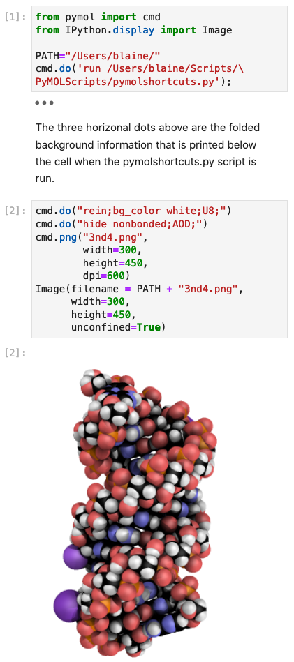

# jupyterlabcctbxsnips
[](https://opensource.org/licenses/MIT)
[](https://doi.org/10.5281/zenodo.4429336)

This readme file serves this GitHub site and three others: [jupyterlabcctbxsnipsplus](https://github.com/MooersLab/jupyterlabpymolcctbxplus), [jupyterlabpymolpysnips](https://github.com/MooersLab/jupyterlabpymolpysnips), and [jupyterlabpymolpysnipsplus](https://github.com/MooersLab/jupyterlabpymolpysnipsplus). 

An associated GitHub Pages list the name snippets by <a class="tab" href="https://mooerslab.github.io/jupyterlabcctbxsnips/"> category.</a>


## Introduction

The PyMOL is a powerful and popular molecular graphics program. 
The Computational Crystallography Toolbox (CCTBX) is the open-source part of the Phenix project. 
JuptyerLab is an Integrated Development Environment (IDE) for editing Jupyter Notebooks. 
Jupyter Notebooks support reproducible computational work in structural biology with CCTBX and PyMOL. 

Jupyter Notebooks notebooks are also useful for exploring new software and deplyinging tutorials for new software. 
They are popular in the computational sciences. 
For example, 9.7 million Jupyter Notebooks were shared on GitHub as of December 2020.

The purpose of this site is to support the use of PyMOL and CCTBX together in Jupyter Notebooks. 
Snippet libraries for PyMOL and CCTBX support the computational work. The snippet libraries depend on the extension for JupyterLab called jupyterlab-snippets-multimenus. 
Unfortunately, the extensions for the Classic Jupyter Notebook do not run in JupyterLab and vice versa. 
To enjoy the jupyterlab-snippets-multimenus extension, the notebook must be edited in JupyterLab. 

There are several snippet extensions for the Classic Jupyter Notebook. None of these are as easy for users to install and customize as the jupyterlab-snippets-multimenus extension. 
Regardless, all of the extensions for snippets still fall short of the support for snippets found in modern text editors and IDEs. 
For example, the Jupyter extensions do not support tab triggers and tab stops. 
If you have used snippets in text editors or IDEs, you will have to dampen your expectations when using snippets in Jupyter Notebooks.

If the installation is successful, a scene in the browser like the figure below will appear. 
You will be able to select the kernel named pc38 instead of the default Python3 kernel. 
In this case, the default kernel will also work. 
The open circle by `pc38` means that the kernel is running.

The column at the left margin shows that the `jupyterlab-snippets-multimenus` extension has been installed.
The menubar should have `cctbx cctbx+ pymol pymol+` listed between `Kernel` and `Tabs`. 
Cell [1] in the Juptyer Notebook has been executed. 
The execution imported the `map_model_manager` class from CCTBX.
No error messages were returned.
Cell [2] imported the `cmd` class from pymol.
No error messages were returned.
Cell [3] shows the use of bang to run a bash command. 
In this case, the Python interpreter is being used to return documentation to the area below the cell
The blue bar in the left margin was triple-clicked to fold this output and replace it with three dots.

<p align="center"></p>

The figure below shows part of the cascading menus for the cctbx library. 
The submenus correspond to the names of subfolders in the cctbx folder in the multimenus_snippets folder.
Each ultimate menu item is a Python snippet file. 
The selection of a snippet file by clicking on it with the left-mouse button inserts its content into a new cell below the current cell. 
The millerArrayFromMtz.py snippet at the bottom of the pulldown menu was selected and inserted in the figure below. 
Commented lines have text that describes what this snippet does. 
The code in this cell would be executed by entering Shift-Enter.
<p align="center"></p>

## Some simple examples

The figures below demonstrate running PyMOL from inside a Jupyter notebook.
The `cmd.do()` method sends the PyMOL command language (pml) commands to PyMOL.
(The PyMOL command language is a Domain-specific Language (DSL) that is limited to PyMOL.)
This method takes the pml commands as its argument.
Semicolons concatenated several pml commands to save space.
Quotes enclose a group of concatenated commands.

The `cmd.png()` method saves a png file of an RNA duplex image.
This method has its arguments passed to it in the style of a Python function.
The Image class from IPython loads the png file and displays it below Cell [2].

The RNA duplex is rendered with an approximation of the ambient occlusion or photorealistic effect. 
This effect is not available in PyMOL.
`AOD` renders the effect.
`AOD` colors the carbon atoms black.
The `AO` shortcut colors the carbons light grey. 
`AODBW` and `AOBW` color the atoms in grayscale.
Grayscale coloring is also not found in PyMOL, but it is available in the pymolshortcuts.py file.
The `rein` invokes the `reinitialize` command.
The `U8` fetches PDB file 3nd4, generates the biological unit, and orients the molecular object.

The above shortcuts are part of over 250 functions loaded by running the `pymolshortcuts.py` script in Cell [1].
The shortcuts are listed below Cell [1] when the script is loaded.
Folding hid the list.
Clicking the three dots displays the list. 
The script is available for download [here](https://github.com/MooersLab/pymolshortcuts). 

Cell [1] demonstrates how external Python scripts can be loaded and run in PyMOL inside a Jupyter Notebook.
Note that the script is run in the same manner that a Python script is loaded and run at PyMOL prompt in the PyMOL GUI.

<p align="center"></p>

The function `get_symm()` is from Robert Campbell's script `list_symm.py`.
It takes the space group number as an argument to look up the space group information in the `sgtbx` module of CCTBX.
It is used here to display the symmetry operators of space group 155 with the shorthand notation found in the International Tables of Crystallography and as rotation matrices plus translation vectors.
This space group is the same as that for the above crystal structure (3ND4).
This function uses the `sys` module.
That module was loaded upon running the `pymolshortcuts.py` script in [1], so no need to import it again. 

<p align="center"></p>

The mtzObjectSummary.py snippet prints a summary of an mtz file.
The mtz file contains data for SirA-like protein (DSY4693) from Desultobacterium hafniense, Northeast
Structural Genomics Consortium Target DhR2A.

The inspiration for this plot comes from the ReciprocalSpaceship project.
The data in this mtz has columns of I(+) and I(-).
We use these data to make a I(+) vs I(-) scatter plot below.

<p align="center"></p>

The I(+) vs I(-) plot below was made after reading the X-ray data into a cctbx Miller array, a data structure designed for X-ray data.
The I(+) and I(-) were eventually read into separate lists.
We plot the two lists against each other in a scatter plot.

<p align="center"></p>

There are two advanced Matplotlib features in this plot.
First, the imported `MultipleLocator` function enforced even distribution of the tick labels.
Second, the imported `FunctionFormatter` added the commas to the thousandths place in the tick mark labels.


## Roadmap of rest of this page

The first section below describes five ways to install Jupyter, PyMOL, and CCYBX so that they can play together.
There may be more ways. 
Please post an issue if you want to share another approach.
Please post an issue if one of the ways below changes.
Of course, as per the License, use these protocols at your own risk. 
There are other ways to run Jupyter like Binder and Collab.
The latter two are great for demonstrations, but their limitations hinder serious work.

The second section provides quick checks of the installation.
Run the checks on the command line or in the Jupyter Notebook.

The third section provides scripts for running the test scripts.

## Five ways to install PyMOL, CCTBX, and Jupyter 

All three packages are complex and best kept isolated in a dedicated environment.
Configuration files and paths from prior installations of these programs may hinder the new software installations. 
To solve this problem, edit of the `.bashrc` or `.zshrc` startup files.

The extensions to `JupyterLab` depend on `Node.js`. 
Conda may erroneously report that node and npm are not installed.
Eliminate this error by enabling the server extension.
Do this by running `jupyter serverextension enable --py jupyterlab --user`.

Conda may issue an error message to install node and npm.
This message is misleading when both programs are already installed. 
Run `jupyter serverextension enable --py jupyterlab --user` to solve this problem. 

The extension `jupyterlab-snippets-multimenus` is not compatible with JuptyerLab version 3.0.0.
The JuptyerLab version 2.2.0 has to be installed instead.

If trouble emerges, try another approach.
To remove a broken conda env, enter `conda env remove --name <env name>`.
Once a setup is working, **Do NOT!** tinker with it by adding new extensions or upgrading the packages.
Conflicts between dependent software will eventually break the setup.
If you must add more packages, create a new environment and build your new setup there.

I suggest keeping notes on the nature of your conda environments.
After you have created two, it is easy to lose track of their nature.


### PyMOL and CCTBX share a Python interpreter from Anaconda

The first approach is outlined in the series of code listings below.
I recommend copying and pasting one command at a time.
You may need to update or change the names of some of the links and file paths if one of the commands returns errors.

The first approach creates one Anaconda environment for using both PyMOL and CCTBX.
This approach uses one kernel in Jupyter.
It eliminates the need to switch between kernels in one notebook.
The protocol worked on a fresh instance on Ubuntu 20.04.
It also works on Mac OSX.
If you have installed cctbx in the past, be sure to comment out the LIBTBX_DIR environment in your .bashrc or .zshrc file.
If you have intall juputer in the past, you may want to remove the old configuration files in ~/.jupyter if

, but  although I had to move my `/usr/local/include` directory to avoid conflicts. 

First, update the existing software on Ubuntu and install Node.js and git.

```bash
apt install nodejs npm git
```

Next, download the appropriate Anaconda installation script.
This script is run in the home directory to install Anaconda locally in your home directory.
This negates the need to use sudo.

```bash
wget -P /home/blaine https://repo.anaconda.com/archive/Anaconda3-2020.02-Linux-x86_64.sh
bash Anaconda3-2020.02-Linux-x86_64.sh
```

One conda command with a long argument list is run to install Jupyter, PyMOL, and CCTBX.
Here, the environment name `pc37` represents `pymol-cctbx-python3.7`.
The shorthand name for the environment reduces the typing required when using this environment.
Next, activate this new environment and install verion 2.2.0 of JupyterLab.
The newer versions of JuptyerLab do not work with the jupyterlab-snippets-multimenus extensions that we want to install and use to manage the snippets.

```bash
conda create -n pc37 python=3.7 schrodinger::pymol-bundle=2.4.1 conda-forge::cctbx-base conda-forge::jupyter
conda activate pc37
conda install conda-forge::jupyterlab=2.2.0
```

Now install the extension from PyP and run the following command to activate the extension.
```bash
pip install jupyterlab-snippets-multimenus
jupyter lab build
```

Run the first command to get a list of paths to the librairies.

Select the top option under Data.
This is where the libraries will be stored.
The snippet libraries are stored in the first path listed under Data.
This path varies with the operating system.

Make a subdirectory named `multimenus_snippets` in this directory and change directories to it. _

```bash
jupyter --path
cd ~/.local/share/jupyter # change as per output from prior line
mkdir multimenus_snippets
cd multimenus_snippets
````

Run git clone to install the four libraries into four subdirectories that will become four menu items.
The four subdirectories do not have to be created before .


```bash
git clone https://github.com/MooersLab/jupyterlabcctbxsnips.git cctbx
git clone https://github.com/MooersLab/jupyterlabcctbxsnipsplus.git cctbx+
git clone https://github.com/MooersLab/jupyterlabpymolpysnips.git pymol
git clone https://github.com/MooersLab/jupyterlabpymolpysnipsplus.git pymol+
```

The `+` versions have guides for editing the snippets.
These annotations may become an annoyance for experienced users. 
You can also download each repository as a zip file. 


Change directories back to your home directory and start up JuptyerLab.
No error messages should appear in the terminal.
The menu bar in JupyterLab should contain the items `cctbx`, `cctbx+`, `pymol` and `pymol+`.

```bash
cd ~/
jupyter lab # or if you wish, run libtbx.python -m jupyter-lab
```

The bash alias command `alias pcJL='conda activate pc37 && juptyer lab'` can reduce subsequent typing.
If there are irresolvable error messages, remove the broken environment with the command `conda env remove --name pc37`.
This first protocol has the upside of using one kernel to call CCTBX and PyMOL and the downside of possible disruptions by updates to either PyMOL or CCTBX.
 
The following commands may help if you run into trouble. 
The first command registers jupuyterlab as an extension.
The second command cleans up the build of jupyterlab and can be run before `jupyter lab build`.

```bash
jupyter serverextension enable --py jupyterlab --user
jupyter lab clean
```

The `jupyter --path` command returns a list of paths that vary between operating systems.
The snippet libraries are stored in the first path listed under Data.
This path varies with the operating system.
Next, navigate to this directory and create the subdirectory `multimenus_snippets`.
Then `git clone` the repositories of interest. 

The final command launches JupyterLab in the default web browser.

Below is the alternate protocol for PyMOL version 2.4.1 and Python3.8.
This protocol worked on January 7, 2021.

```bash
apt install nodejs npm git
wget -P /home/blaine https://repo.anaconda.com/archive/Anaconda3-2020.02-Linux-x86_64.sh
bash Anaconda3-2020.02-Linux-x86_64.sh
conda create -n pc38 python=3.8 schrodinger::pymol-bundle=2.4.1 conda-forge::cctbx-base conda-forge::jupyter -y
conda activate pc38
conda install conda-forge::jupyterlab=2.2.0 -y
# The following may be needed
# jupyter serverextension enable --py jupyterlab --user 
pip install jupyterlab-snippets-multimenus
# jupyter lab clean
jupyter lab build # can take awhile
ipython kernel install --name pc38 --user # create a kernel
# Stored in /home/blaine/.local/share/jupyter/kernels/pc38
jupyter --path # select the top option under Data for storing the libraries
cd ~/.local/share/jupyter # change as per output from prior line
mkdir multimenus_snippets
cd multimenus_snippets
git clone https://github.com/MooersLab/jupyterlabcctbxsnips.git cctbx
git clone https://github.com/MooersLab/jupyterlabcctbxsnipsplus.git cctbx+
git clone https://github.com/MooersLab/jupyterlabpymolpysnips.git pymol
git clone https://github.com/MooersLab/jupyterlabpymolpysnipsplus.git pymol+
cd ~/
jupyter lab # or libtbx.python -m jupyter-lab
```

The above protocols are adapted to Mac OS X by changing the Anaconda install script's name and the paths.
The snippets are stored in `~/Library/Juptyer/multimenus_snippers` on a Mac.
The kernels are stored in `~/Library/Juptyer/kernels`.

If `Node.js` is missing, install it with Anaconda or Home Brew. 
`Node.js` must of a version greater than 10.0.0 (e.g., `conda install conda-forge::nodejs=15.3`). 
Anaconda will sometimes degrade `Node.js` to around version 6 when installing some other software in the env.

A prior installation of `JuptyerLab=3.0.0` can cause trouble.
Run `jupyter serverextension enable --py jupyterlab --user` to reset the configuration for `JupyterLab=2.2.0`.
If desparate, delete the configuration in `~/.juptyer` and reinstall.


### PyMOL and CCTBX have separate Python interpreters from Anaconda

This second protocol creates a new conda environment for CCTBX and uses an existing installation of PyMOL.
The upside of this approach is that updates to one program will not break the other program.
JupyterLab is installed in both the CCTBX environment and again in PyMOL.
Separate kernels are created for CCTBX and for the Python interpreter in the PyMOL.app.
PyMOL and  CCTBX cannot be called from the same cell.
Also, the kernel has to be switched when changing programs.
The name  `cctbx37` is designed to track the Python version used to create the environment. 
Create a Jupyter kernel also named `cctbx37`.


With PyMOL installed via its installer, open PyMOL and install Jupyter inside PyMOL.
Use the command `conda install -c conda-forge jupyter -y` entered at the PyMOL prompt.
The install can be slow and the PyMOL prompt may appear to hang.
Give it several minutes to complete.
Success at installation is reported to the command history window.
Next, create a kernel named `pymol2.4.1`.
Enter the following command that contains the path to the Ipython executable inside of the `PyMOL.app`.
On the Mac, the path and command is as follows: `/Applications/PyMOL.app/Contents/bin/ipython kernel install --name pymol37 --user`.

Download and move the snippet libraries into place as above.
```bash
conda create -n cctbx37 python=3.7 conda-forge::cctbx-base conda-forge::jupyter 
conda install conda-forge::jupyterlab=2.2.0
ipython kernel install --name cctbx37 --user
```

```bash
# Inside PyMOL, paste the following at the command prompt
conda install conda-forge::jupyter conda-forge::jupyterlab=2.2.0 -y
```


```bash
# Inside PyMOL, paste the following at the command prompt
/Applications/PyMOL.app/Contents/bin/jupyter serverextension enable --py jupyterlab --user
/Applications/PyMOL.app/Contents/bin/pip install jupyterlab-snippets-multimenus
```


```bash
/Applications/PyMOL.app/Contents/bin/jupyter lab build
/Applications/PyMOL.app/Contents/bin/jupyter lab clean
```


```bash
/Applications/PyMOL.app/Contents/bin/ipython kernel install --name pymol --user
```


```bash
/Applications/PyMOL.app/Contents/bin/jupyter --path # select the top option under Data for storing the libraries
cd ~.local/share/jupyter # change as per output from prior line
mkdir multimenus_snippets
cd multimenus_snippets
```


```bash
git clone https://github.com/MooersLab/jupyterlabcctbxsnips.git cctbx
git clone https://github.com/MooersLab/jupyterlabcctbxsnipsplus.git cctbx+
git clone https://github.com/MooersLab/jupyterlabpymolpysnips.git pymol
git clone https://github.com/MooersLab/jupyterlabpymolpysnipsplus.git pymol+
```


```bash
cd ~/
/Applications/PyMOL.app/Contents/bin/jupyter lab 
```

After starting JuptyerLab, select either the `pymol` kernel or the `cctbx37`.


### Install CCTBX inside of PyMOL

The third protocol uses the conda binary that ships with PyMOL.
It does not require a separate Anaconda installation.
This protocol assumes that `git` is already installed.
Open PyMOL and then install with separate conda commands jupyter, jupyter-lab, and cctbx-base.

```bash
# At the PyMOL prompt in the PyMOL GUI paste the following:
conda install conda-forge::cctbx-base conda-forge::jupyter 
conda install conda-forge::jupyterlab=2.2.0
conda install conda-forge::cctbx-base
````

The next commands issued from the terminal.
Adjust the path to the PyMOL.app as needed.
Enable the JupyterLab server extension.

```bash
/Applications/PyMOL.app/Contents/bin/jupyter serverextension enable --py jupyterlab --user
```

Create a Juptyer kernel named `pymol`.

```bash
/Applications/PyMOL.app/Contents/bin/ipython kernel install --name pymol --user
```

Install the JuptyerLab extension with `pip`.

```bash
/Applications/PyMOL.app/Contents/bin/pip install jupyterlab-snippets-multimenus
```

Rebuild JupyterLab and install the snippets via git clone.

```bash
/Applications/PyMOL.app/Contents/bin/jupyter lab clean
/Applications/PyMOL.app/Contents/bin/jupyter lab build
```

Select the top option under Data for storing the libraries.

```bash
/Applications/PyMOL.app/Contents/bin/jupyter --path
```

Change as per output from the prior command, make the subdirectory `multimenus_snippets`, and change to this subdirectory.

```bash
cd ~.local/share/jupyter
mkdir multimenus_snippets
```

Install the the libraries with git.

```bash
git clone https://github.com/MooersLab/jupyterlabcctbxsnips.git cctbx
git clone https://github.com/MooersLab/jupyterlabcctbxsnipsplus.git cctbx+
git clone https://github.com/MooersLab/jupyterlabpymolpysnips.git pymol
git clone https://github.com/MooersLab/jupyterlabpymolpysnipsplus.git pymol+
```

Change to the home directory and create a kernel `pymol37`.

```bash
cd ~/
/Applications/PyMOL.app/Contents/bin/ipython kernel install --name pymol37 --user
```

Launch the JupyterLab with the command.

```bash
/Applications/PyMOL.app/Contents/bin/jupyter-lab
```

To ease reuse of the JupyterLab installed in PyMOl, add the following or similar alias to the `.bashrc` file.

```bash
alias pJL='/Applications/PyMOL.app/Contents/bin/jupyter-lab'
```

The upside of this approach is that CCTBX can be called while using the `PyMOL` kernel.
There is no need to switch kernels.
The downsides of this approach are that it may be fragile to updates of either `PyMOL` or `CCTBX`.
Before updating `PyMOL`, rename the old version to avoid overwriting it.
Appending the version number (e.g., `PyMOL241.app`) will not impede its operation.


### Install Open -source PyMOL wheel with the Python interpreter used to install CCTBX (Windows only)

A fourth protocol is restricted to Windows.
Wheel files for installing PyMOL are available for [download](https://www.lfd.uci.edu/~gohlke/pythonlibs/\#pymol-open-source).
Determine the version of Python already present and whether the operating system is 32- or 64-bit.
The Python interpreter used to run CCTBX can also be used to install PyMOL with the `pip.exe install` command. 
Both CCTBX and PyMOL will share the same Python interpreter.
Conda or `pip.exe` can be used to install Jupyter and then JupyterLab. 
Then `pip.exe` would be used to install `jupyterlab-snippets-multimenus` as above.

```bash
/Applications/PyMOL.app/Contents/bin/ipython kernel install --name pymol37 --user
```


###  Install PyMOL with cctbx.python (Fedora, maybe other Linuxes)

A fifth protocol applies where there is a clear path to building PyMOL from source code.
The idea is to build and install PyMOL using the same Python Interpreter that was used to build CCTBX.
This approach is adapted from the one for [Fedora](https://pymolwiki.org/index.php/CCTBX-fedora32).
This approach does not require creating an environment.
Supplement this protocol with the following commands.

```bash
/usr/local/miniconda3/bin/conda install -p /usr/local/cctbx-dev-2130/conda_base conda-forge::juptyer
/usr/local/miniconda3/bin/conda install -p /usr/local/cctbx-dev-2130/conda_base conda-forge::juptyerlab=2.2.0
````


```bash
/usr/local/miniconda3/bin/pip install jupyterlab-snippets-multimenus
/usr/local/miniconda3/bin/ipython kernel install --name pymolcctbx --user
```


```bash
/usr/local/miniconda3/bin/jupyter --path
cd ~.local/share/jupyter # change as per Data line in output from prior comment
mkdir multimenus_snippets
cd multimenus_snippets
```


```bash
git clone https://github.com/MooersLab/jupyterlabcctbxsnips.git cctbx
git clone https://github.com/MooersLab/jupyterlabcctbxsnipsplus.git cctbx+
git clone https://github.com/MooersLab/jupyterlabpymolpysnips.git pymol
git clone https://github.com/MooersLab/jupyterlabpymolpysnipsplus.git pymol+
```

XXXXXXXXXXX

```bash
cd ~/
/usr/local/miniconda3/bin/jupyter lab
```### Open Source PyMOL in Ubuntu and CCTBX and JuptyerLab from Anaconda


## Quick check of the installation


Next, verify that PyMOL and CCTBX can be called from the same notebook.
Launch JupyterLab and open a new notebook.
Select the appropriate kernel.
Enter in the first cell `from pymol import cmd` and enter `Shift-Return`.
No error message should appear.
Enter in the next cell the following command `from iotbx.map_model_manager import map_model_manager`.
No errors should be returned by this operation if all is installed correctly.

Where both CCTBX and PyMOL are run by the same Python interpreter, activate the appropriate environment and run the following command in a terminal:

```bash
python -c 'from pymol import cmd; from iotbx.map_model_manager import map_model_manager'
```

If all goes well, the terminal will hang for about five seconds and then return nothing.
Otherwise, error messages will be printed in the terminal window.


## More extensive tests


The CCTBX installation in a conda environment can be tested by running the following bash script.

```bash
#! /bin/sh
set noglob
set verbose
libtbx.python $CONDA_PREFIX/lib/python3.7/site-packages/libtbx/run_tests.py
libtbx.python $CONDA_PREFIX/lib/python3.7/site-packages/iotbx/run_tests.py
libtbx.python $CONDA_PREFIX/lib/python3.7/site-packages/boost_adptbx/run_tests.py
libtbx.python $CONDA_PREFIX/lib/python3.7/site-packages/fable/run_tests.py
libtbx.python $CONDA_PREFIX/lib/python3.7/site-packages/scitbx/run_tests.py
libtbx.python $CONDA_PREFIX/lib/python3.7/site-packages/cctbx/run_tests.py
libtbx.python $CONDA_PREFIX/lib/python3.7/site-packages/cctbx/run_examples.py
libtbx.python $CONDA_PREFIX/lib/python3.7/site-packages/smtbx/run_tests.py
libtbx.python $CONDA_PREFIX/lib/python3.7/site-packages/cflib_adaptbx/run_tests.py
libtbx.python $CONDA_PREFIX/lib/python3.7/site-packages/reduce/run_tests.py
libtbx.python $CONDA_PREFIX/lib/python3.7/site-packages/mmtbx/run_tests.py
libtbx.python $CONDA_PREFIX/lib/python3.7/site-packages/cctbx_website/run_tests.py
libtbx.python $CONDA_PREFIX/lib/python3.7/site-packages/gltbx/run_tests.py
```

If cctbx was installed with Python3.8, use the following bash script.

```bash
#! /bin/sh
set noglob
set verbose
libtbx.python $CONDA_PREFIX/lib/python3.8/site-packages/libtbx/run_tests.py
libtbx.python $CONDA_PREFIX/lib/python3.8/site-packages/iotbx/run_tests.py
libtbx.python $CONDA_PREFIX/lib/python3.8/site-packages/boost_adptbx/run_tests.py
libtbx.python $CONDA_PREFIX/lib/python3.8/site-packages/fable/run_tests.py
libtbx.python $CONDA_PREFIX/lib/python3.8/site-packages/scitbx/run_tests.py
libtbx.python $CONDA_PREFIX/lib/python3.8/site-packages/cctbx/run_tests.py
libtbx.python $CONDA_PREFIX/lib/python3.8/site-packages/cctbx/run_examples.py
libtbx.python $CONDA_PREFIX/lib/python3.8/site-packages/smtbx/run_tests.py
libtbx.python $CONDA_PREFIX/lib/python3.8/site-packages/cflib_adaptbx/run_tests.py
libtbx.python $CONDA_PREFIX/lib/python3.8/site-packages/reduce/run_tests.py
libtbx.python $CONDA_PREFIX/lib/python3.8/site-packages/mmtbx/run_tests.py
libtbx.python $CONDA_PREFIX/lib/python3.8/site-packages/cctbx_website/run_tests.py
libtbx.python $CONDA_PREFIX/lib/python3.8/site-packages/gltbx/run_tests.py
```

